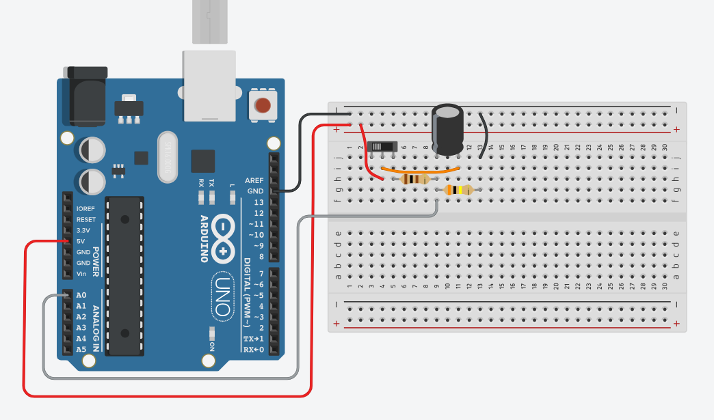
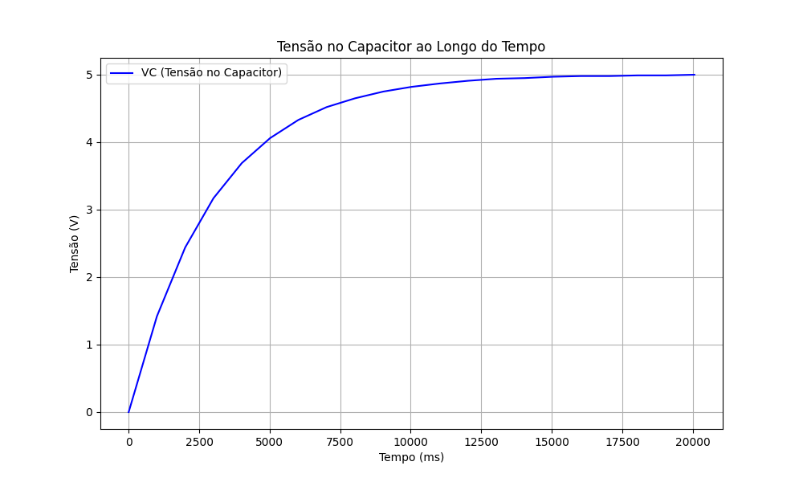
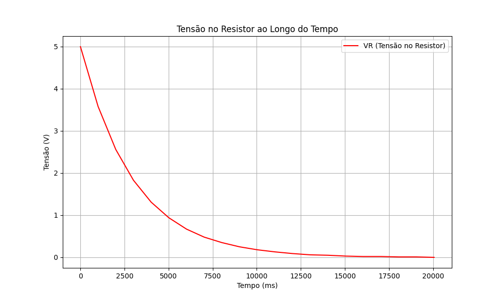
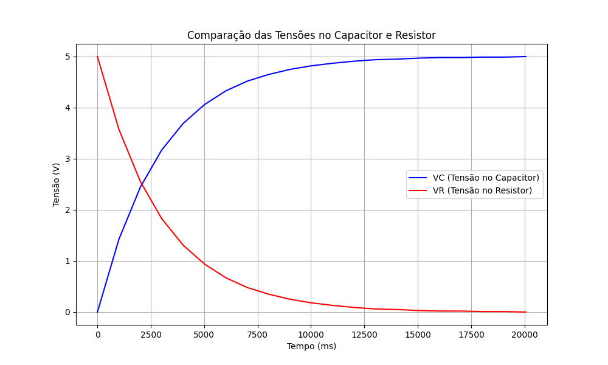

# Filtro de Bounce Usando Capacitor – Simulação no Tinkercad  

Este projeto demonstra como filtrar o efeito **bounce** de interruptores utilizando um **capacitor** em uma simulação no Tinkercad. O circuito é composto por um capacitor, um botão deslizante e dois resistores, e o código lê os valores analógicos das tensões nos dois componentes. Os valores são impressos no Monitor Serial para observar como a tensão varia com o tempo.

## Circuito  

  

### Componentes do Circuito  

- **Capacitor 25V 10&micro;F**: Armazena energia elétrica temporariamente. Neste circuito, o capacitor é usado para suavizar os sinais do interruptor, filtrando as flutuações rápidas (efeito bounce) que ocorrem quando o botão é pressionado ou solto.

- **Resistor 100&Omega;**: Limita a corrente no circuito, protegendo o capacitor e outros componentes. Também influencia na taxa de carga e descarga do capacitor.

- **Resistor 300k&Omega;**: Forma um divisor de tensão com o capacitor e ajuda a controlar a taxa de carga do capacitor, impactando o tempo necessário para estabilizar a tensão.

- **Botão Deslizante**: Atua como um interruptor para simular o comportamento de um botão com bounce. Ao pressionar o botão, ocorre uma série de contatos rápidos e instáveis, que o capacitor suaviza para garantir uma transição mais limpa entre os estados ligados e desligados.

### Explicação do Circuito  

O circuito é um divisor de tensão RC (Resistor-Capacitor) onde o capacitor é conectado em paralelo com o botão deslizante. Quando o botão é pressionado ou solto, ele pode gerar múltiplas transições rápidas (bounce), que são captadas pelo **PINO_SENSOR (A0)** como flutuações na tensão. 

Neste caso:
- **Quando o capacitor carrega**, a tensão **VC** no capacitor aumenta, enquanto a tensão **VR** no resistor diminui, até que o capacitor esteja completamente carregado e VC atinja 5V.
- **Quando o botão é acionado repetidamente**, o capacitor evita que essas flutuações rápidas (bounce) sejam detectadas pelo microcontrolador, fornecendo um sinal estável.

A leitura analógica do pino A0 monitora as tensões ao longo do tempo, exibindo o comportamento do capacitor e do resistor para confirmar a eficácia do filtro RC.

## Código  

```cpp
// Definindo constantes e variáveis globais
const int PINO_SENSOR = A0;  // Pino do sensor (VR)
const float REFERENCIA = 5.0; // Tensão de referência (5V)
const int RESOLUCAO_ADC = 1023; // Resolução do ADC (10 bits)

unsigned long tempo;

void setup() {
  Serial.begin(9600); // Inicializa o Monitor Serial
}

void loop() {
  tempo = millis(); // Obtém o tempo decorrido em ms
  int leituraADC = analogRead(PINO_SENSOR); // Lê o valor do ADC

  // Converte o valor do ADC para tensão
  float vrVolts = leituraADC * (REFERENCIA / RESOLUCAO_ADC);
  float vcVolts = REFERENCIA - vrVolts;

  // Imprime os resultados no Monitor Serial
  Serial.print("VC: ");
  Serial.print(vcVolts, 2);  // 2 casas decimais
  Serial.print("\t TEMPO: ");
  Serial.print(tempo);
  Serial.print(" ms\t VR: ");
  Serial.println(vrVolts, 2);  // 2 casas decimais

  delay(1000); // Atraso de 1 segundo
}
```

## Saída de Exemplo  

```
VC: 0.00    TEMPO: 0      VR: 5.00
VC: 1.42    TEMPO: 1002   VR: 3.58
VC: 2.44    TEMPO: 2004   VR: 2.56
VC: 3.17    TEMPO: 3007   VR: 1.83
VC: 4.99    TEMPO: 19055  VR: 0.01
VC: 5.00    TEMPO: 20059  VR: 0.00
```

## Como Funciona  
1. O capacitor carrega gradualmente, aumentando a **VC** enquanto a **VR** diminui.  
2. Os valores são impressos a cada segundo, simulando o processo de estabilização do capacitor.  
3. O comportamento do capacitor ilustra como ele suaviza variações rápidas, filtrando o **bounce** de um interruptor.  

## Gráficos de Tensões

### Tensão no Resistor  
  

### Tensão no Capacitor  
  

### Curvas Comparativas das Tensões no Capacitor e no Resistor  
  

## Ferramentas Utilizadas  
- **Tinkercad**: Para simulação do circuito  
- **Arduino IDE**: Para desenvolvimento do código  